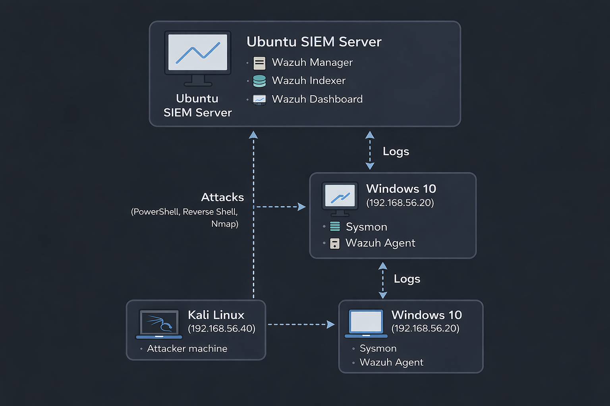
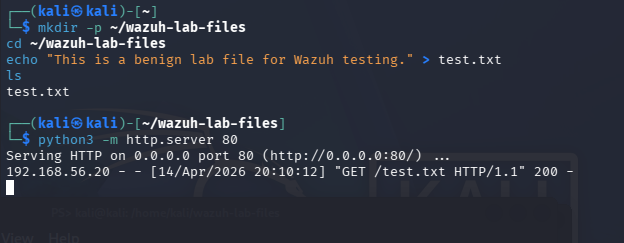
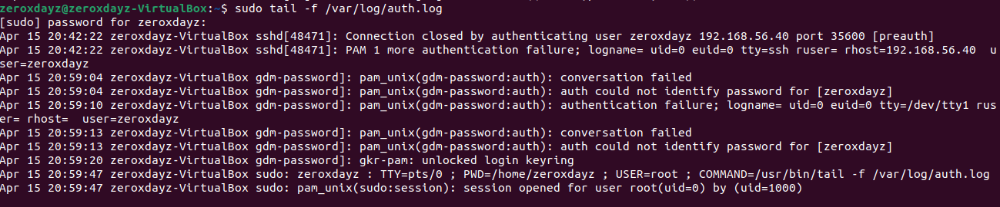
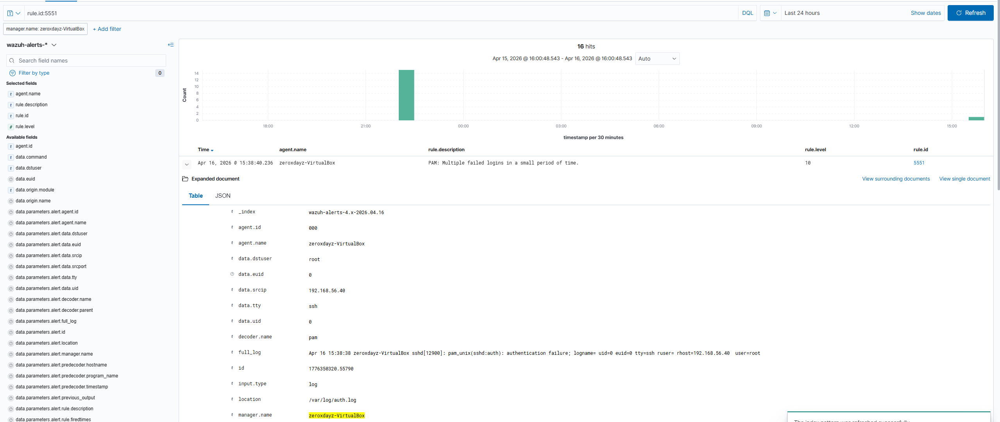
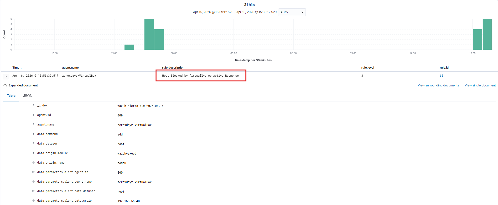
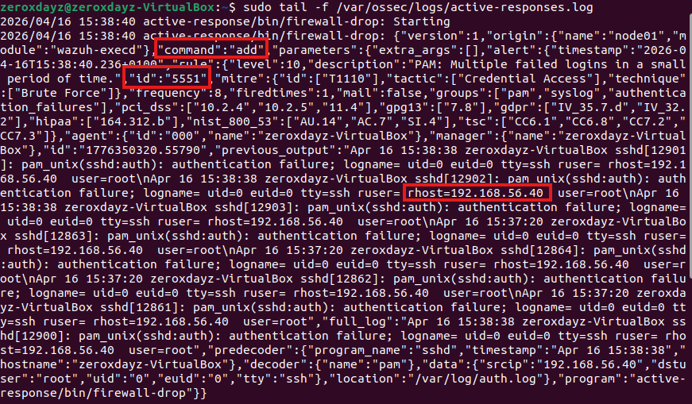
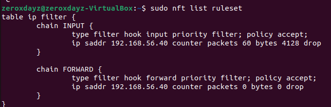

# 🛡️ Wazuh SIEM Lab (Ubuntu): Detect & Respond to SSH Brute Force Attacks

---

## 📌 Overview

This project demonstrates a complete **Security Operations Center (SOC) workflow on Ubuntu** using Wazuh SIEM.

The lab simulates a real-world **SSH brute-force attack** and shows how to:

* Collect Linux authentication logs
* Detect suspicious login behavior
* Generate alerts in Wazuh
* Automatically respond by blocking attacker IPs

---

## 🏗️ Lab Architecture



### 🔹 Systems

* **Wazuh Manager (Ubuntu)** → `192.168.56.10`
* **Kali Linux (Attacker Machine)** → `192.168.56.40`
* **Wazuh Agent-Windows 10 (Target Machine)** → `192.168.56.20`
---

## 🔄 Data Flow

```text
Kali Attack (Hydra)
   ↓
Ubuntu SSH Server
   ↓
Wazuh Log Collector
   ↓
Wazuh Manager (analysisd)
   ↓
Wazuh Dashboard
   ↓
Active Response (firewall-drop)
```

---

## ⚙️ Technologies Used

* Wazuh SIEM (4.x)
* Ubuntu Server
* Kali Linux
* Hydra (Brute-force tool)
* SSH (OpenSSH)
* nftables / iptables
* VirtualBox
* sysmon swiftonsecurity

---

# 🔐 Use Case: SSH Brute Force Detection & Response

---

## 🎯 Scenario

Simulate a brute-force attack using Hydra and automatically block the attacker IP using Wazuh Active Response.

---

## 💥 Attack Simulation (Kali)

```bash
hydra -l root -P ~/test.txt -t 4 ssh://192.168.56.10
```

---

## ⚙️ Log Collection (Ubuntu)

Wazuh monitors SSH authentication logs from:

```text
/var/log/auth.log
```

---

## 🚨 Detection

Wazuh detects repeated failed login attempts using built-in correlation rules.

### Triggered Rule

* **Rule ID:** 5551
* **Description:** PAM: Multiple failed logins in a small period of time
* **MITRE ATT&CK:** T1110 (Brute Force)

---

## 📌  Custom Detection Rule

```xml
<rule id="100600" level="10" frequency="5" timeframe="60">
  <if_matched_sid>5716</if_matched_sid>
  <description>Multiple SSH authentication failures detected (possible brute force)</description>
  <group>authentication_failed,sshd,bruteforce</group>
</rule>
```

---

## ⚡ Active Response Configuration

Configured in `/var/ossec/etc/ossec.conf`:

```xml
<command>
  <name>firewall-drop</name>
  <executable>firewall-drop</executable>
  <expect>srcip</expect>
  <timeout_allowed>yes</timeout_allowed>
</command>

<active-response>
  <disabled>no</disabled>
  <command>firewall-drop</command>
  <location>server</location>
  <rules_id>5551</rules_id>
  <timeout>600</timeout>
</active-response>
```

## 🔄 Detection → Response Correlation

This lab demonstrates a full SOC workflow:

1. Attack initiated from Kali (Hydra brute force)
2. SSH logs generated in `/var/log/auth.log`
3. Wazuh detects repeated failures (Rule 5551)
4. Active response triggers automatically
5. Attacker IP is blocked at firewall level

---

## ✅ Results

* Attacker IP detected: `192.168.56.40`
* Wazuh alert generated
* Active response executed
* Attacker IP successfully blocked

---

## 📸 Evidence

### 🔐 Attack & Detection







---

### ⚡ Active Response Execution





---

### 🛑 Firewall Enforcement



---

### 📊 Dashboard Visibility


---

## 🔎 Validation

---

### 1️⃣ Detection Logs

```bash
grep 5551 /var/ossec/logs/alerts/alerts.json
```

---

### 2️⃣ Active Response Logs

```bash
tail -f /var/ossec/logs/active-responses.log
```

Example:

```text
firewall-drop: add - 192.168.56.40
```

---

### 3️⃣ Firewall Verification

```bash
sudo nft list ruleset
```

Expected:

```text
ip saddr 192.168.56.40 drop
```

---

## ⚡ Active Response Proof (Raw Logs)

The system confirms execution via `wazuh-execd`:

* Command executed: `firewall-drop`
* Action: `add`
* Source IP: `192.168.56.40`

---

## 🧠 How Active Response Works

1. Detection rule triggers (Rule 5551)
2. Alert is sent to `wazuh-execd`
3. Active response script executes
4. Firewall rule is inserted
5. Attacker traffic is blocked

---

## 🎯 Project Objectives

This project demonstrates real-world SOC capabilities:

* Detection of brute-force attacks
* Log correlation and alerting
* Automated incident response
* Endpoint protection via firewall enforcement

---

## 📁 Project Structure

```
wazuh-siem-lab/
│
├── attacks/        # Hydra commands & test files
├── configs/        # Wazuh configuration files
├── rules/          # Custom detection rules
├── screenshots/    # Evidence images
├── README.md
└── LICENSE
```

---

## 🧠 Key Learning Outcomes

* Built a SIEM lab on Ubuntu
* Detected SSH brute-force attacks
* Configured Wazuh Active Response
* Automated IP blocking
* Validated detection-to-response pipeline

---

## 🚀 Future Improvements

* Add Fail2Ban comparison
* Integrate email alerting
* Add GeoIP enrichment
* Create advanced dashboards
* Expand to web attack detection

---

## 💼 Skills Demonstrated

* SIEM Engineering
* Linux Security Monitoring
* Threat Detection (Brute Force)
* Incident Response Automation
* Log Analysis

---

## ⚠️ Disclaimer

This project was conducted in a **controlled lab environment** for educational purposes only.
All attacks were performed on owned systems and custom built internal isolated network.

---

## 👤 Author

**Kissinger Jayaseelan**

