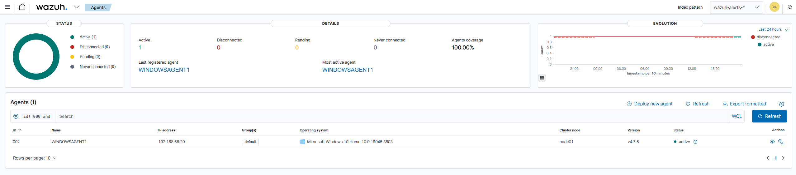
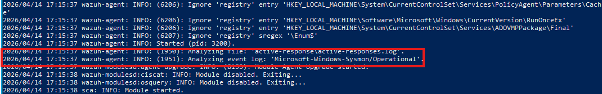

# 🛡️ Wazuh SOC Detection Lab – Multi Use Cases

## 📌 Project Overview

This project is a multi-use case Security Operations Center (SOC) home lab built using **Wazuh SIEM**. It demonstrates detection, analysis, and response across multiple attack scenarios, simulating real-world SOC workflows.

The lab focuses on:
- Log collection and analysis
- Detection engineering using Wazuh rules
- Attack simulation and validation
- Automated and manual response actions
- Analyst-style triage and investigation

---

## 🏗️ Lab Architecture

### Environment Components
- **Ubuntu Server** – Wazuh Manager, Indexer, Dashboard
- **Windows 10 Endpoint** – Sysmon + Wazuh Agent
- **Kali Linux** – Attacker machine

---

## 🔎 Agent & Log Ingestion Verification

### Agent Connected

### Sysmon Logs Being Ingested

---

## 🎯 Use Cases

| Use Case | Technique | Detection | Response |
|----------|----------|----------|----------|
| SSH Brute Force | Credential Access | Rule 5551 | IP Block |
| PowerShell Execution | Execution | Rule 100500 | Alert |
| PowerShell Download | Command & Control | Rule 100501 | Alert |
| Encoded PowerShell | Defense Evasion | Rule 100502 | Alert |
| Nmap Recon | Discovery | Detection Gap | None |

---

## 📂 Detailed Use Cases

### 🔐 SSH Brute Force Detection & Response
- Repeated failed SSH login attempts were detected through Linux authentication logs.
- Wazuh correlated the activity using Rule `5551`.
- Active Response blocked the attacker IP through firewall enforcement.

👉 [View Full Case Study](attacks/ssh-bruteforce.md)

### 💻 PowerShell Execution Detection
- Sysmon process creation events were forwarded from the Windows endpoint into Wazuh.
- A custom rule was used to highlight PowerShell execution activity.
- This use case demonstrates endpoint visibility and alert generation.

👉 [View Full Case Study](attacks/powershell-execution.md)

### 🌐 PowerShell Download Detection
- PowerShell download activity was simulated using `Invoke-WebRequest`.
- Command-line visibility allowed Wazuh to match suspicious behavior.
- A custom rule raised the severity of the alert.

👉 [View Full Case Study](attacks/powershell-download.md)

### 🔐 Encoded PowerShell Detection
- Obfuscated PowerShell commands using `-enc` were simulated in the lab.
- A custom rule detected encoded command execution.
- This use case highlights suspicious execution patterns often associated with malicious tradecraft.

👉 [View Full Case Study](attacks/powershell-encoded.md)

### 🌐 Nmap Reconnaissance
- A network scan was launched from Kali Linux against the lab target.
- The activity was observed as part of the simulation.
- Wazuh did not generate an alert, demonstrating a host-based detection gap for network reconnaissance.

👉 [View Full Case Study](attacks/reconnaissance-nmap.md)

---

## 📊 Wazuh Dashboard Overview

---

## 🔍 Detection Strategy

- Linux detection uses **auth.log** and PAM authentication events
- Windows detection uses **Sysmon telemetry**
- Wazuh correlates logs and generates alerts
- Custom rules extend visibility into PowerShell-related behavior

---

## ⚡ Response Mechanisms

### Active Response
- Automatic IP blocking via firewall

### Alert-Based Detection
- Alerts requiring analyst review and triage

---

## 🧬 MITRE ATT&CK Mapping

| Use Case | Technique |
|----------|----------|
| SSH Brute Force | T1110 |
| PowerShell Execution | T1059.001 |
| PowerShell Download | T1105 |
| Encoded PowerShell | T1027 |
| Nmap Recon | T1046 |

---

## 🛠️ Tuning and False Positive Considerations

- Repeated failed SSH logins can also result from legitimate user mistakes or administrative testing.
- PowerShell execution is common in Windows administration and does not always indicate malicious activity.
- `Invoke-WebRequest` may appear in benign scripts, software updates, or automation tasks.
- Encoded PowerShell commands are high-signal, but tuning is still important in enterprise environments.

---

## 📚 Lessons Learned

- Built-in Wazuh rules effectively detect brute-force activity
- Sysmon provides strong endpoint visibility
- PowerShell detections require tuning to reduce false positives
- Host-based monitoring has limited visibility for network scanning
- Active response is powerful but should be controlled carefully

---

## 🚀 Future Improvements

- Integrate Suricata or Zeek for network-based detection
- Add alert enrichment and threat intelligence context
- Expand detection coverage to additional attacker behaviors
- Improve tuning and triage workflows

---

## ⚠️ Disclaimer

This project was conducted in a controlled lab environment.  
All attacks were simulated on owned systems.

---

## 👤 Author

SOC Lab Project by **ZeroXDayz**

