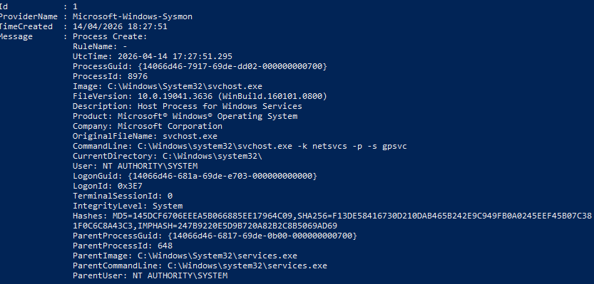

# 💻 Use Case: PowerShell Execution Detection

## 🎯 Objective
Detect PowerShell execution activity on a Windows endpoint.

---

## ⚔️ Attack Simulation

Command executed:
```powershell
powershell -Command "Write-Host test"
```


---

## 📄 Log Source

- Source: Sysmon Event ID 1 (Process Creation)



---

## 🔍 Detection Logic

- Base Rule: **92027** (PowerShell execution)
- Custom Rule: **100500**

```xml
<rule id="100500" level="10">
  <if_sid>92027</if_sid>
  <description>Custom: PowerShell execution detected</description>
</rule>
```

---

## 🚨 Alert Evidence


---

## 🧠 Analyst Triage

- **Process:** powershell.exe  
- **User:** SYSTEM  
- **Technique:** T1059.001 – PowerShell  
- **Severity:** Medium  
- **Verdict:** True Positive  

---

## 📚 Lessons Learned

- Sysmon provides visibility into process execution  
- PowerShell detection is essential for endpoint monitoring  
