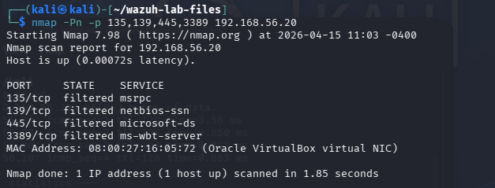

# 🌐 Use Case: Nmap Reconnaissance

## 🎯 Objective
Simulate network reconnaissance using Nmap and evaluate detection capability.

---

## ⚔️ Attack Simulation

Command executed:
```bash
nmap -Pn -p 135,139,445,3389 192.168.56.20
```



---

## 📄 Observed Behavior

- Target host responded to scan  
- Ports filtered  

---

## 🔍 Detection Result

- No alerts generated in Wazuh  

---

## ⚠️ Detection Gap

- Wazuh is host-based SIEM  
- Does not detect network scanning effectively  

---

## 🧠 Analyst Insight

- **Technique:** T1046 – Network Service Discovery  
- **Verdict:** Activity observed, not detected  

---

## 📚 Lessons Learned

- Host-based detection has visibility limitations  
- Network IDS (Suricata / Zeek) required for full coverage  
